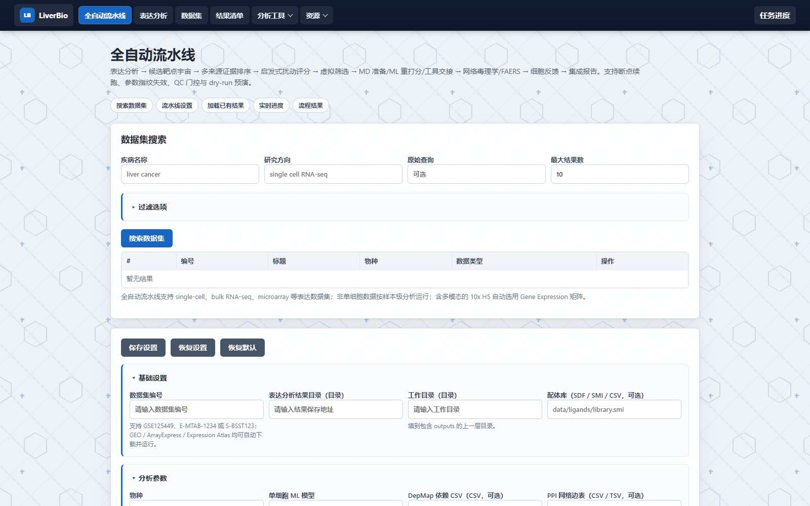

# Liver Cancer Bioinformatics Workflow

> 当前版本：1.7.1

本地审查修复说明见 [修复与验证记录](docs/review_fixes_20260920.md)。此次未更新发布版本。旧缓存缺少输入指纹时会重算；MD 默认 `maxwarn=0`，只有通过轨迹和完成状态检查的运行才计为完成。

面向肝癌与肝病研究的本地生信自动化工作流。项目把表达谱分析、靶点证据整理、虚拟筛选、分子对接、分子动力学、结果报告和网页操作集中到同一套可复现流程中。

支持单细胞、bulk RNA-seq、microarray 等表达数据，结果写入 `run_manifest.json`，记录配置、输入哈希、软件版本和运行参数。



## 功能

| 模块 | 主要内容 |
| --- | --- |
| 表达分析 | GEO、ArrayExpress、Expression Atlas 数据下载；QC、聚类、注释、差异表达、GO/KEGG/GSEA、ML/SHAP |
| 全自动集成流水线 | 从表达分析筛选候选靶点，衔接证据排序、虚拟敲除、虚拟筛选、MD/ML 交接、网络毒理学、FAERS 和细胞反馈 |
| 虚拟筛选与 CADD | 靶点证据、受体和配体准备、AutoDock Vina、命中排序、精细重对接、ML 重打分、MD 与外部工具导出 |
| 独立分子对接 | 使用独立配置和工作目录运行受体/配体准备、Vina 对接、结果分析、精细重对接和 HTML 报告 |
| 高级多队列分析 | limma/ComBat、WGCNA、多模型机器学习、外部验证、免疫浸润、生存分析与 MR/共定位 |
| 多数据库证据中心 | 统一整理 Open Targets、ChEMBL、BindingDB、PubChem、GWAS Catalog、ClinVar、GTEx、HPA、DepMap 等证据 |
| 网页端 | 任务启动、实时日志、暂停和继续、结果浏览、文件下载、环境检查与一键补全 |

## 快速开始

### 1. 安装环境

Windows 新电脑推荐使用根目录脚本：

```text
setup_new_computer.bat
check_new_computer.bat
```

Linux/macOS 使用对应的 `.sh` 脚本。

也可以只安装实际需要的功能板块：

```text
launchers\install_expression_environment.bat
launchers\install_docking_environment.bat
launchers\install_molecular_docking_environment.bat
launchers\install_md_environment.bat
launchers\install_full_environment.bat
launchers\install_web_environment.bat
```

通用环境检查：

```text
liverbio doctor
```

详细部署说明见 [NEW_COMPUTER_SETUP.md](NEW_COMPUTER_SETUP.md)。

### 2. 运行分析

表达分析：

```text
liverbio expression GSE125449 --output ../liver_cancer --species auto
```

全自动集成流水线：

```text
liverbio full --accession GSE125449 --output ../liver_cancer --workdir ../liver_cancer_full
```

虚拟筛选：

```text
liverbio docking pipeline --config config/docking_config.json
```

数据集搜索：

```text
liverbio datasets --disease "liver cancer" --max-results 20
```

查看完整命令：

```text
liverbio help
liverbio version
```

也可以绕过统一入口，直接运行原有脚本：

```text
python scripts\run_pipeline.py GSE125449 --output ../liver_cancer --species auto
python scripts\run_full_pipeline.py --accession GSE125449 --output ../liver_cancer --workdir ../liver_cancer_full
python scripts\run_docking.py pipeline --config config/docking_config.json
python scripts\run_molecular_docking.py pipeline --config config/molecular_docking_config.json
```

### 3. 打开网页端

```text
launchers\run_web_ui.bat
```

默认地址：`http://127.0.0.1:8000/full`

常用页面：

| 页面 | 地址 |
| --- | --- |
| 全自动流水线 | `/full` |
| 表达分析 | `/` |
| 数据集搜索 | `/datasets` |
| 虚拟筛选 | `/dock` |
| 分子对接 | `/molecular-docking` |
| 分子动力学 | `/md-simulation` |
| 虚拟敲除 | `/knockout` |
| 高级分析 | `/analysis` |
| 结果清单 | `/results` |

网页端默认只监听本机回环地址。绑定非回环地址时会自动启用访问令牌。

## 输出位置

| 运行类型 | 主要输出 |
| --- | --- |
| 表达分析 | `results/` 下的数据、图片、HTML/DOCX/PDF 报告与分析报告 |
| 全自动流水线 | `integration_report.html`、`integration_summary.json`、`run_manifest.json` 及阶段目录 |
| 虚拟筛选 | `dock/outputs/<run>/results/`、对接结果表、ML/MD 交接文件和 HTML 报告 |
| 独立分子对接 | `molecular_docking/outputs/<run>/results/` 和 `molecular_docking_report.html` |

`data_cache/`、`dock/outputs/`、`results/` 等运行产物默认不会提交到 Git。

## 环境要求

- Python 3.10+，推荐 3.11。
- R 4.5+。
- 实验方案一的原方案方法还要求 R 包 `MCL`、`CellChat`、`scTenifoldKnk`，以及 PLIP 3.0.1；安装脚本已纳入这些依赖。
- GeneCards、OMIM、TTD 等授权导出和授权凭证路径登记在 `config/experiment_plan_one_source_authorizations.json`，缺少时对应 Panel 保持 `blocked`。
- AutoDock Vina，虚拟筛选时使用。
- GROMACS、ACPYPE 和 gmx_MMPBSA，运行分子动力学时使用。

按功能板块查看软件、Python 包和 R 包要求：

- [环境需求总览](docs/environment_requirements.md)
- [虚拟筛选专项清单](VIRTUAL_SCREENING_REQUIREMENTS.md)

## 文档

| 文档 | 说明 |
| --- | --- |
| [软件使用指南](docs/software_guide.md) | `liverbio`、网页端、常用工作流和 Codex Skills |
| [新电脑部署](NEW_COMPUTER_SETUP.md) | Windows/Linux/macOS 安装、检查与源码打包 |
| [环境需求](docs/environment_requirements.md) | 各功能板块的环境清单与安装入口 |
| [多数据库证据中心](docs/evidence_hub.md) | 证据模型、来源配置、评分和 CLI |
| [项目结构](docs/project_structure.md) | 代码模块和目录职责 |
| [脚本冻结与交付分级](docs/experiment_plan_one_script_freeze_20260923.md) | 实验方案一冻结范围、问题总表、方法替代登记和三级交付门槛 |
| [结果图指南](docs/result_figure_guide.md) | 结果文件用途与判读说明 |
| [更新日志](CHANGELOG.md) | 历史版本与变更记录 |

## 测试

```text
python -m pytest -q
```

GitHub Actions 会在 Windows/Linux 和 Python 3.11 上运行测试。

## 许可

MIT License。详见 [LICENSE](LICENSE)。
